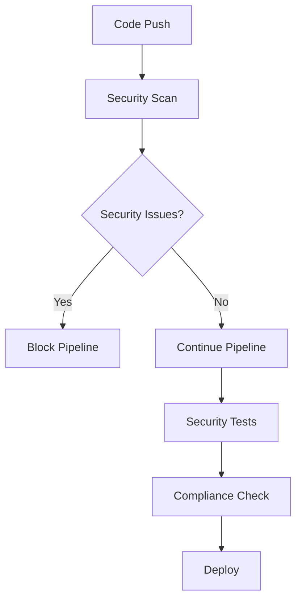

# 🚀 CareNow MVP - CI/CD Pipeline Setup Guide

This comprehensive guide explains how to set up and use the CI/CD pipelines for the CareNow MVP Flutter application.

## 📋 Table of Contents

- [Overview](#overview)
- [Prerequisites](#prerequisites)
- [Pipeline Architecture](#pipeline-architecture)
- [Setup Instructions](#setup-instructions)
- [Workflow Details](#workflow-details)
- [Environment Configuration](#environment-configuration)
- [Security Integration](#security-integration)
- [Troubleshooting](#troubleshooting)

## 🎯 Overview

The CareNow MVP CI/CD pipeline provides:

- **Automated Testing**: Unit, integration, and security tests
- **Multi-Platform Builds**: Web, Android, and iOS
- **Environment-Specific Deployments**: Development, staging, and production
- **Security Integration**: Advanced security scanning and compliance checks
- **Release Management**: Automated versioning and changelog generation

## 📋 Prerequisites

### Required Tools

1. **GitHub Repository** with admin access
2. **GitHub CLI** (`gh`) installed and authenticated
3. **Firebase Project** set up for each environment
4. **Google Play Console** account (for Android deployment)
5. **Apple Developer** account (for iOS deployment)

### Required Secrets

Run the setup script to configure all required secrets:

```bash
./.github/scripts/setup-secrets.sh
```

## 🏗️ Pipeline Architecture

### Workflow Files

| Workflow | Purpose | Trigger |
|----------|---------|---------|
| `ci.yml` | Continuous Integration | Push, PR |
| `build.yml` | Multi-platform builds | Push to main/develop |
| `deploy.yml` | Automated deployment | After successful build |
| `release.yml` | Release management | Git tags |
| `security-audit.yml` | Security scanning | Schedule, security changes |

### Environment Structure

```
.github/
├── workflows/           # GitHub Actions workflows
├── environments/        # Environment configurations
├── scripts/            # Helper scripts
└── docs/              # Documentation
```

## 🔧 Setup Instructions

### 1. Initial Setup

1. **Clone the repository** with CI/CD configuration
2. **Run the secrets setup script**:
   ```bash
   ./.github/scripts/setup-secrets.sh
   ```
3. **Configure environment protection rules** in GitHub repository settings

### 2. Firebase Configuration

For each environment (dev, staging, prod):

1. Create Firebase project
2. Generate service account key
3. Set up hosting targets:
   ```bash
   firebase target:apply hosting dev your-project-dev
   firebase target:apply hosting staging your-project-staging
   firebase target:apply hosting production your-project-prod
   ```

### 3. Android Setup

1. **Generate signing key**:
   ```bash
   keytool -genkey -v -keystore carenow-release-key.keystore -alias carenow -keyalg RSA -keysize 2048 -validity 10000
   ```

2. **Encode keystore to base64**:
   ```bash
   base64 -i carenow-release-key.keystore | pbcopy
   ```

3. **Set up Google Play Console**:
   - Create service account
   - Download JSON key
   - Grant necessary permissions

### 4. iOS Setup (macOS only)

1. **Create distribution certificate** in Apple Developer portal
2. **Create provisioning profile** for app
3. **Export certificate as .p12** file
4. **Encode to base64**:
   ```bash
   base64 -i certificate.p12 | pbcopy
   ```

## 🔄 Workflow Details

### Continuous Integration (ci.yml)

**Triggers**: Push, Pull Request
**Jobs**:
- Setup & Validation
- Security Scanning
- Code Analysis
- Testing Suite (Unit, Integration, Security)
- Performance Validation

**Key Features**:
- Parallel test execution
- Security-first approach
- Comprehensive code analysis
- Performance monitoring

### Multi-Platform Build (build.yml)

**Triggers**: Push to main/develop, Tags, Manual
**Jobs**:
- Build Setup
- Web Build
- Android Build (APK + AAB)
- iOS Build

**Key Features**:
- Environment-specific builds
- Code obfuscation for production
- Artifact management
- Build optimization

### Deployment Pipeline (deploy.yml)

**Triggers**: Successful build, Manual
**Jobs**:
- Deployment Setup
- Production Approval (if required)
- Security Pre-deployment Check
- Web Deployment (Firebase Hosting)
- Android Deployment (Google Play)

**Key Features**:
- Environment-specific deployment
- Manual approval for production
- Security validation
- Rollback capabilities

### Release Management (release.yml)

**Triggers**: Git tags, Manual
**Jobs**:
- Release Preparation
- Build Release Artifacts
- Create GitHub Release
- Post-Release Tasks

**Key Features**:
- Automated changelog generation
- Multi-platform release artifacts
- Version management
- Release notes generation

### Security Audit (security-audit.yml)

**Triggers**: Schedule, Security file changes, Manual
**Jobs**:
- Security Configuration Audit
- Code Security Scan
- Dependency Security Scan
- Comprehensive Security Test

**Key Features**:
- Daily security scans
- Integration with security managers
- Vulnerability detection
- Compliance checking

## 🌍 Environment Configuration

### Development Environment
- **Purpose**: Feature development and testing
- **Auto-deploy**: Yes
- **Security Level**: Low
- **Testing**: Unit + Integration

### Staging Environment
- **Purpose**: Pre-production testing
- **Auto-deploy**: Yes
- **Security Level**: Medium
- **Testing**: Full test suite + Performance

### Production Environment
- **Purpose**: Live application
- **Auto-deploy**: No (requires approval)
- **Security Level**: High
- **Testing**: Comprehensive + Load testing

## 🔐 Security Integration

### Security Managers Integration

The CI/CD pipeline integrates with existing security infrastructure:

- **AdvancedSecurityManager**: Runtime security enforcement
- **SecurityComplianceManager**: Compliance checking
- **EnvironmentConfig**: Environment-specific security settings

### Security Checks

1. **API Key Scanning**: Prevents hardcoded secrets
2. **Dependency Scanning**: Checks for vulnerable packages
3. **Code Analysis**: Static security analysis
4. **Compliance Testing**: GDPR, security standards
5. **Performance Security**: Security impact assessment

### Security Workflow



## 🚀 Usage Examples

### Triggering Builds

```bash
# Trigger development build
git push origin develop

# Trigger staging build
git push origin main

# Trigger production release
git tag v1.0.0
git push origin v1.0.0

# Manual deployment
gh workflow run deploy.yml -f environment=staging -f platforms=web
```

### Monitoring Deployments

```bash
# View workflow runs
gh run list

# View specific run
gh run view <run-id>

# View logs
gh run view <run-id> --log
```

## 🔧 Troubleshooting

### Common Issues

1. **Build Failures**
   - Check Flutter version compatibility
   - Verify dependencies are up to date
   - Review build logs for specific errors

2. **Deployment Failures**
   - Verify secrets are correctly set
   - Check Firebase project configuration
   - Ensure proper permissions

3. **Security Scan Failures**
   - Review hardcoded secrets
   - Update vulnerable dependencies
   - Check security configuration

### Debug Commands

```bash
# Test locally
flutter test
flutter analyze
flutter build web --release

# Check secrets
gh secret list

# View environment configuration
cat .github/environments/production.yml
```

## 📊 Monitoring and Metrics

### Key Metrics

- **Build Success Rate**: Target 95%+
- **Deployment Time**: Target <10 minutes
- **Test Coverage**: Target 90%+
- **Security Score**: Target 100%

### Monitoring Tools

- GitHub Actions dashboard
- Firebase Console
- Google Play Console
- App Store Connect

## 🎯 Best Practices

1. **Always test locally** before pushing
2. **Use feature branches** for development
3. **Review security scans** before merging
4. **Monitor deployment metrics**
5. **Keep dependencies updated**
6. **Follow semantic versioning**

## 📞 Support

- **Documentation**: This guide and inline comments
- **Issues**: GitHub Issues for bug reports
- **Discussions**: GitHub Discussions for questions
- **Security**: Private security reporting

---

**🎉 Your CI/CD pipeline is now ready for production use!**
